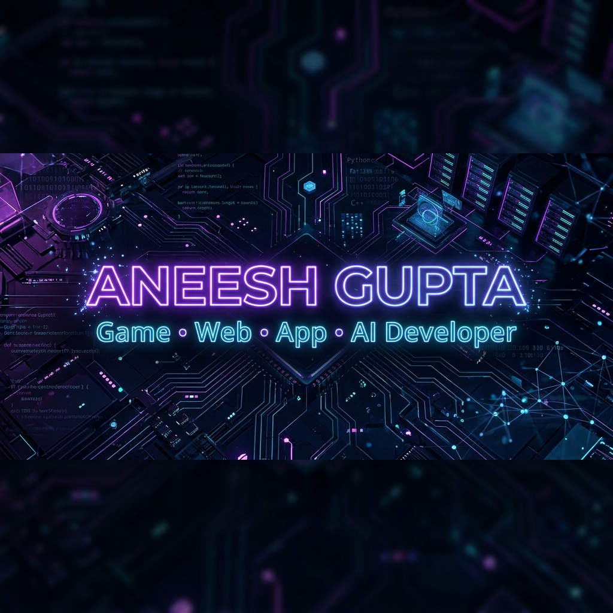

  

  # Hi there, I'm Aneesh Gupta (AndyDev94) 👋
  
  ### 🎮 Indie Game Developer • 💻 Full-Stack Web & App Developer • 🤖 AI Integration Specialist
  
  
  
  
  
  

---

### 📖 About Me

I am a 20-year-old computer geek and student pursuing my **B. Tech in Computer Science and Engineering** (2023 - 2027) at Sandip University. As a passionate game developer, full-stack engineer, and AI builder, I enjoy taking on creative challenges and constructing intelligent, containerized applications.

*   👥 **Vice President** at **SECT Open-Source Community**, a college club empowering students with technology.
*   🕹️ Finished **15+ game projects** in Godot Engine, specializing in 2D/3D development, physics, light and shadow mechanics.
*   💻 Full-Stack developer experienced in building web applications with **React** and **Node.js**, and containerizing services using **Docker**.
*   🤖 Enthusiastic about **AI Innovations**, working with OpenAI APIs, LLM integrations, and building smart software.
*   🎬 Formally trained in video editing, having edited **100+ videos** and boosted client engagement by 25% (using DaVinci Resolve).
*   🎨 Experienced in 3D Modeling (creating low-poly assets in Blender) and UI/UX design.

---

### 🛠️ Tech Stack & Tools

<table align="center" width="100%">
  <tr>
    <td align="center" width="25%" valign="top">
      <h4>🕹️ Game & 3D Dev</h4>
       
      
    </td>
    <td align="center" width="25%" valign="top">
      <h4>💻 Languages</h4>
       
       
       
      
    </td>
    <td align="center" width="25%" valign="top">
      <h4>🌐 Web & App Dev</h4>
       
       
       
       
      
    </td>
    <td align="center" width="25%" valign="top">
      <h4>🔧 AI, DevOps & Tools</h4>
       
       
       
       
      
    </td>
  </tr>
</table>

---

### 🚀 Projects

Here are some of the key web applications, games, and mobile apps I've built:

*   🌐 **[NicheChat](https://nichechat.aneesh.co.in)** - A feature-rich, privacy-focused web-based social media platform engineered with a strict focus on user security and a clean, responsive UX/UI.
*   📄 **[Invoice Maker](https://invoice.aneesh.co.in)** - A lightweight, quick-and-easy invoice generation platform designed to let users create, share, download, and print custom invoices directly from their browsers.
*   🎮 **[Barbie Phone Simulator](https://play.google.com/store/apps/details?id=com.aneesh.phone)** - A highly polished 2D simulation game built for Android, published on [Google Play Store](https://play.google.com/store/apps/details?id=com.aneesh.phone) and [Itch.io](https://andydev16.itch.io/).
*   📷 **[Geo Tagged Camera](https://geotag.aneesh.co.in)** - An ad-free, seamless browser-based application built to capture photos and videos embedded with real-time location data.
*   🎵 **[Meditation Music](https://play.google.com/store/apps/details?id=com.aneeshyoga.my_app)** - A calming yoga and meditation application published on the [Google Play Store](https://play.google.com/store/apps/details?id=com.aneeshyoga.my_app).
*   🌌 **[NASA Sonification Simulation](https://andydev16.itch.io/nasa2024)** - An immersive 3D spatial audio game developed for the NASA Space Apps Challenge, translating complex astronomical data into dynamic soundscapes.

---

### 📊 GitHub Stats & Metrics

  <table border="0">
    <tr>
      <td>
        
      </td>
      <td>
        
      </td>
    </tr>
  </table>
  
   
  
  

---

### 🏆 Volunteering & Certifications

*   🏆 **AI Challenge**: Completed the *Vibe Code: 5 Apps in 5 Days* challenge (June 2026).
*   🌟 **SUNHACKS 2025**: Led technical planning and infrastructure deployment for an international-level hackathon.
*   🎒 **Sandipotsav 2026**: Managed a multidisciplinary technical team to coordinate event operations with zero downtime.

---

  Designed with ❤️ and customized for AndyDev94. Portfolio: <a href="https://aneesh.co.in">aneesh.co.in</a>

